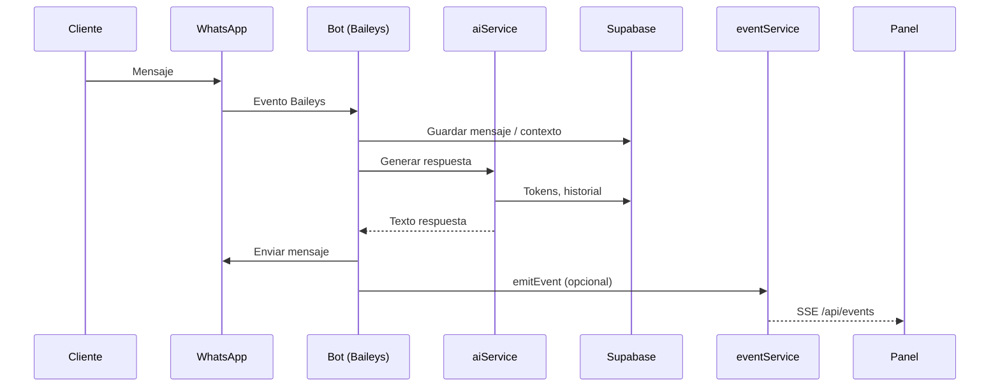
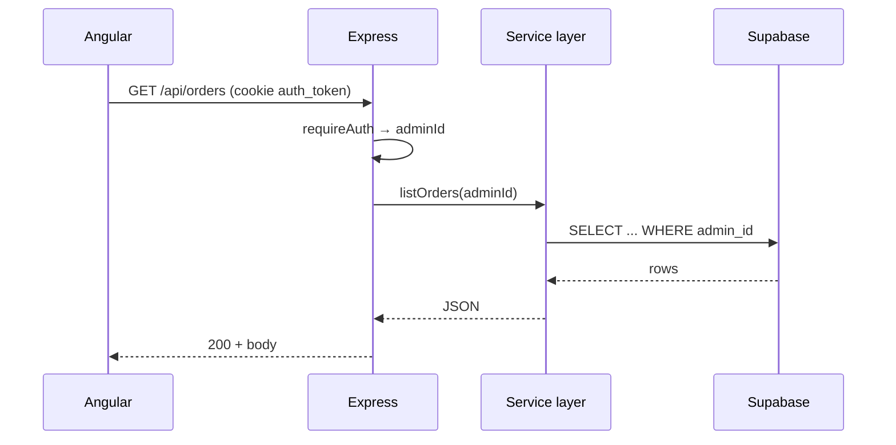

# Flujo de datos

## 1. Mensaje entrante de WhatsApp

El bot usa `conversationService` para historial, `orderService` para pedidos y `aiService` para completions con prompt construido desde `config/aiConfig.js` y la fila `configuracion` del admin.

## 2. Creación de pedido desde conversación

1. La IA o reglas de negocio detectan intención de compra.
2. Se crea/actualiza registro en `pedidos` con estado `pendiente`.
3. Stock se reserva o valida según migraciones (`restaurar_stock_pedido_rpc`).
4. `notificationService` puede crear notificación para el panel.
5. El admin ve el pedido en **Pedidos** y recibe evento SSE.

## 3. Panel web → API

Los repositorios Angular (`infrastructure/api/api.repository.ts`) centralizan llamadas con `withCredentials`.

## 4. Autenticación

1. `POST /api/auth/login` valida bcrypt contra `administradores`.
2. Se emite JWT y se setea cookie `auth_token` (httpOnly, secure en prod).
3. `GET /api/auth/me` devuelve perfil + features del plan activo.
4. `requireAuth` middleware decodifica JWT en cada ruta protegida.

## 5. Catálogo PDF

1. Admin genera PDF desde productos (`POST /api/catalog/generate-from-products`).
2. Backend compone PDF (pdfkit) y sube a GCS.
3. Descarga vía `GET /api/catalog/pdf` con URL firmada o stream.

## 6. Widget de chat embebido

Ruta pública `POST /api/chat` (rate limited) para sitios externos que cargan `/widget/chatbot.js`. No usa cookie de admin; contexto limitado al chat widget.

## Eventos SSE

`GET /api/events` mantiene conexión abierta. Servicios emiten con `emitEvent(adminId, type, payload)` para:

- Nuevos pedidos o cambios de estado
- Notificaciones
- Actualizaciones de conversación

El frontend suscribe en páginas que requieren tiempo real (dashboard, notificaciones).
