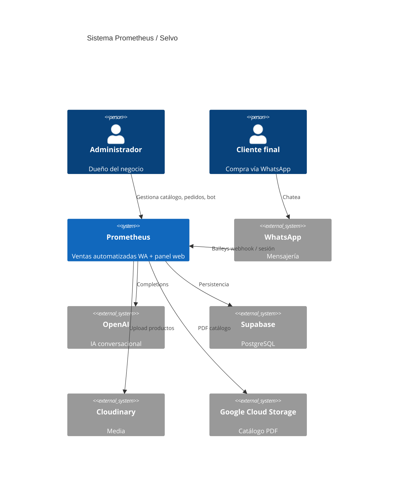

# Visión general del sistema

## Contexto (C4 — Nivel 1)



## Contenedores (C4 — Nivel 2)

| Contenedor | Tecnología | Responsabilidad |
|------------|------------|-----------------|
| **prometheus-interface** | Angular SPA | Landing, login, panel `/app/*` |
| **prometheus-service** | Express | API REST, auth, SSE, widget |
| **WhatsApp Bot** | BuilderBot + Baileys | Un proceso por admin activo |
| **Jobs en proceso** | Node timers | Pedidos vencidos, mantenimiento IA |

No hay microservicios separados en runtime: el bot y la API viven en el mismo proceso Node (`server.js`).

## Capas del backend

```
┌─────────────────────────────────────────┐
│  routes/          HTTP + rate limits    │
├─────────────────────────────────────────┤
│  middleware/      auth (JWT cookie)     │
├─────────────────────────────────────────┤
│  controllers/     validación HTTP       │
├─────────────────────────────────────────┤
│  services/        lógica de negocio     │
├─────────────────────────────────────────┤
│  config/ + bot/   infra, IA, WhatsApp   │
└─────────────────────────────────────────┘
           │
           ▼
      Supabase (PostgreSQL)
```

## Capas del frontend

Arquitectura **hexagonal** simplificada:

```
presentation/  →  UI (pages, atoms, molecules, organisms)
domain/        →  modelos + ports (interfaces)
infrastructure/→  adaptadores HTTP (repositories)
core/          →  guards, auth, config transversal
```

Ver detalle en [Arquitectura frontend](/docs/frontend/architecture).

## Puntos de entrada HTTP

| Prefijo | Auth | Uso |
|---------|------|-----|
| `/api/auth` | Parcial | Login, registro, logout, `/me` |
| `/api/public` | No | Planes públicos (landing) |
| `/api/catalog` | Sí | PDF catálogo (GCS) |
| `/api` | Mayoría sí | REST del panel + chat widget |
| `/widget` | Estático | Script embebible del chat |

## Decisiones de diseño clave

1. **Multi-tenant por `admin_id`** — Todas las tablas de negocio filtran por administrador.
2. **Sesión en cookie httpOnly** — Evita XSS con tokens en localStorage; requiere CORS con credentials.
3. **SSE para tiempo real** — `/api/events` empuja notificaciones y cambios al panel.
4. **Un bot por admin** — Escalado vertical; reconexión y timers gestionados en `whatsappBot.js`.
5. **Planes como feature flags** — `planService` + `PLAN_FEATURES` gatean endpoints y UI.

## Relacionado

- [Flujo de datos](/docs/architecture/data-flow)
- [Multi-tenancy](/docs/architecture/multi-tenancy)
- [Backend overview](/docs/backend/overview)
