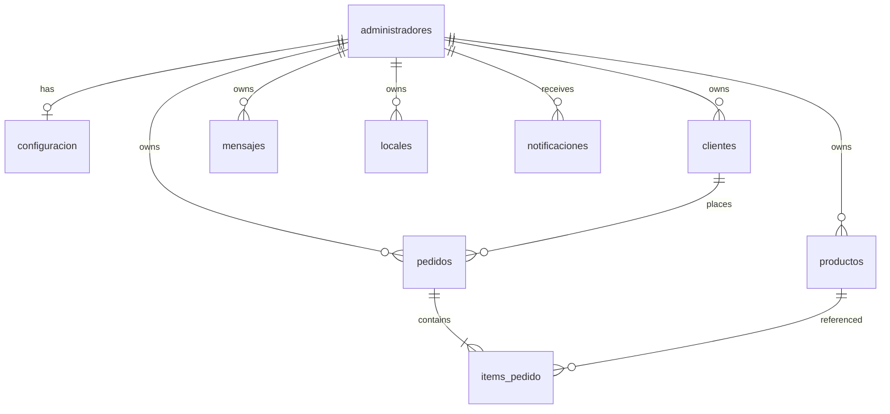

# Esquema de base de datos

Fuente de verdad: migraciones en `prometheus-service/migrations/`, empezando por `0001_initial_schema.sql`.

## Diagrama entidad-relación (simplificado)



## Tablas principales

### administradores

Tenant root. Email único, `password_hash` bcrypt, `whatsapp_numero`, flag `activo`.

### configuracion

Una fila por admin: personalidad del bot, idioma, instrucciones, `admin_phones[]`, stock mínimo, URLs de pago, etc.

### productos

Catálogo: nombre, precio, stock, descripción, `imagen_url`, `media_urls[]`, `activo`.

### clientes

Compradores identificados por `telefono` (único por admin).

### pedidos + items_pedido

Pedido con `estado_pedido` enum y líneas que referencian productos y cantidades.

### mensajes

Historial conversación WA: `telefono`, `rol_mensaje` (`user`|`assistant`), contenido, timestamps.

### planes

Definición de planes comerciales y features (migraciones `0002`, `0003`).

### locales

Sucursales / puntos de entrega (`0004_locales_...`).

### notificaciones

Alertas para el panel (pagos, pedidos, etc.).

## ENUMs

```sql
estado_pedido: pendiente | pagado | enviado | entregado | cancelado
estado_pago:   pendiente | confirmado | rechazado
rol_mensaje:   user | assistant
nivel_log:     info | success | warning | error
```

## Índices y constraints

- FK con `ON DELETE CASCADE` desde hijos hacia `administradores` donde aplica.
- `UNIQUE(admin_id, telefono)` en clientes.
- Checks en precios y stock `>= 0`.

## RPC y funciones

Migraciones posteriores añaden funciones como `restaurar_stock_pedido_rpc` (`0008`) para consistencia transaccional en cancelaciones.

## Acceso desde código

Cliente Supabase service-role en backend únicamente. Nunca exponer service key al frontend.
