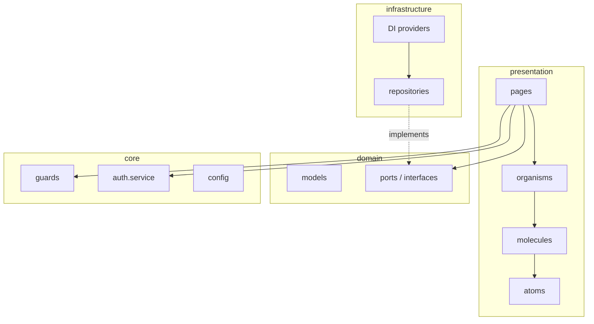

# Arquitectura frontend

El frontend aplica una **arquitectura hexagonal** (ports & adapters) adaptada a Angular standalone.

## Capas



## domain/

- **models/** — Interfaces TypeScript alineadas con JSON del API (`order.model.ts`, `conversation.model.ts`, …).
- **services/*/ports/** — Contratos que la infraestructura implementa (`api.repository.port.ts`).

Sin dependencias de Angular HTTP aquí — solo tipos y abstracciones.

## infrastructure/

Adaptadores concretos:

```typescript
// infrastructure.ts
export const InfrastructureProviders = [
  ...ApiProvider,
  ...AuthProvider,
  ...ExportProvider,
];
```

- `api.repository.ts` — CRUD hacia `/api/*`
- `auth.repository.ts` — login, logout, me
- `export.repository.ts` — descargas Excel/PDF

Inyectados vía `InjectionToken` definidos en ports.

## presentation/

UI pura + estado de página. No construir URLs a mano; inyectar repository/port.

## core/

Cross-cutting:

- `auth.service.ts` — estado sesión, observable usuario
- `auth.guard.ts` / `login.guard.ts` — protección rutas
- `confirm.service.ts` — diálogos confirmación (ui-host)
- `config/url.ts` — construcción URLs API

## Beneficios

| Beneficio | Cómo se logra |
|-----------|---------------|
| Testabilidad | Mock de ports sin HTTP |
| Cambio de API | Solo tocar infrastructure |
| UI consistente | Atomic Design en presentation |
| Lazy loading | Rutas con `loadComponent` |

## Anti-patrones a evitar

- `HttpClient` directo en componentes de página.
- Modelos duplicados divergentes del backend.
- Lógica de negocio compleja en templates.
- CSS global sin BEM por componente.

## Landing como sub-sistema

`presentation/pages/landing/` tiene sus propios atoms/molecules/organisms e i18n (`i18n/en.json`) — scope aislado del panel `/app`.
