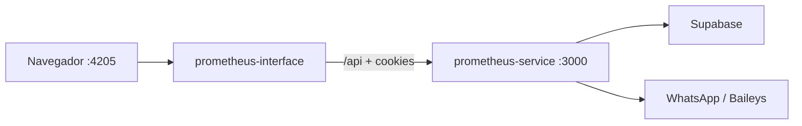

# Desarrollo local

## Visión general

En local el flujo típico es:



## Backend (prometheus-service)

```bash
cd prometheus-service
pnpm install
cp .env.example .env.local   # si existe; ajustar variables
pnpm run start:local
```

Scripts disponibles en `package.json`:

| Script | Descripción |
|--------|-------------|
| `start:local` | Carga `.env.local` y arranca `server.js` |
| `start:dev` | Carga `.env.dev` |
| `create-admin` | Crea un administrador vía CLI |
| `assign-plan` | Asigna plan a un admin |

El servidor expone:

- **API:** `http://localhost:3000/api`
- **Auth:** `http://localhost:3000/api/auth`
- **Widget chat:** `http://localhost:3000/widget/chatbot.js`

Al iniciar, el servicio conecta Supabase, levanta bots de admins activos y arranca el checker de pedidos vencidos.

## Frontend (prometheus-interface)

```bash
cd prometheus-interface
pnpm install   # o npm install
pnpm run start:local
```

La app corre en **puerto 4205** (`ng serve --configuration local`). Las configuraciones `local`, `development` y `production` definen `environment.apiUrl` hacia el backend correspondiente.

## Documentación (este sitio)

```bash
cd prometheus-documentation
npm install
npm start
```

Docusaurus sirve en `http://localhost:3000` por defecto. Si choca con el backend, usa:

```bash
npm start -- --port 3001
```

## Orden recomendado de arranque

1. Supabase accesible (remoto o local).
2. `prometheus-service` en `:3000`.
3. `prometheus-interface` en `:4205`.
4. Login en `/login` con un admin creado (`pnpm run create-admin`).

## CORS y cookies

El backend valida orígenes en `ALLOWED_ORIGINS` (lista separada por comas). Incluye `http://localhost:4205` en local. La autenticación usa cookie **httpOnly** `auth_token`; el frontend debe enviar `withCredentials: true` en peticiones HTTP (ya configurado en los repositorios de infraestructura).

## Solución de problemas frecuentes

| Síntoma | Causa probable | Acción |
|---------|----------------|--------|
| `EADDRINUSE :3000` | Proceso Node previo | Reiniciar `npm start`; el server intenta matar PID en `.bot-server.pid` |
| CORS bloqueado | Origen no en `ALLOWED_ORIGINS` | Añadir URL del front |
| Login 401 | Cookie no enviada | Verificar mismo site / proxy / `withCredentials` |
| Bot no conecta | Credenciales WA / entorno | Revisar logs de `whatsappBot.js` |
