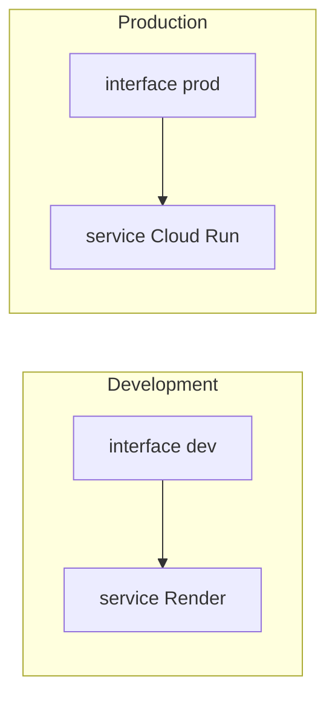

# Entornos

## Matriz de entornos

| | Local | Development | Production |
|---|-------|-------------|------------|
| **Frontend URL** | `localhost:4205` | Cloudflare Pages (dev) | Cloudflare Pages (prod) |
| **Backend URL** | `localhost:3000` | Render | GCP Cloud Run |
| **Supabase** | Proyecto dev compartido | Dev/staging | Producción |
| **WhatsApp** | Sesión real opcional | Staging numbers | Números clientes |
| **Cookies secure** | No | Sí (HTTPS) | Sí |

## Configuración cruzada



Cada build de Angular embebe `apiUrl` del backend correspondiente vía `environment.*.ts`.

## Variables críticas por entorno

### Backend

- `ALLOWED_ORIGINS` — debe listar exactamente el origen del front (sin trailing slash inconsistente).
- `JWT_SECRET` — único por entorno.
- Claves Supabase del proyecto correcto.
- GCS buckets separados dev/prod si aplica.

### Frontend

- `apiUrl` en environment file matching al deploy.
- Cloudflare env vars para builds CI si no se commitean URLs sensibles.

## Datos y seguridad

- No usar service role de prod en local.
- Anon key de Supabase no sustituye service role en backend.
- Backups PITR activados en Supabase prod.

## Local vs remoto

Desarrollo día a día:

```bash
# Terminal 1
cd prometheus-service && pnpm run start:local

# Terminal 2
cd prometheus-interface && pnpm run start:local
```

Opcional: túnel (ngrok, cloudflared) para probar webhook WA contra máquina local — documentar URL en config bot si se usa.

## Promoción de cambios

1. Feature branch → PR → merge `dev`
2. CI dev deploy + QA manual
3. Merge `dev` → `master` + workflow GCP CI+CD
4. Tag release + notas en changelog interno

Ver [Calidad y pruebas](/docs/qa/testing-strategy) para criterios de salida.
