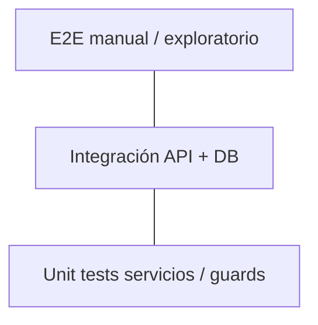

# Estrategia de pruebas

## Pirámide recomendada



Prometheus hoy tiene **cobertura unitaria limitada** en frontend (Karma configurado) y smoke manual. Esta guía define el enfoque objetivo.

## Backend — prometheus-service

### Smoke manual (cada PR crítico)

- [ ] `pnpm run start:local` arranca sin error Supabase
- [ ] Login / logout cookie
- [ ] CRUD producto con imagen
- [ ] Listar y cambiar estado pedido
- [ ] GET `/api/events` mantiene conexión
- [ ] Bot status (si WA configurado)

### Integración

- Probar contra Supabase dev con datos fixture.
- Validar migraciones nuevas en branch antes de merge.

### Automatización futura

- Node test runner o vitest para `services/` puros (mock Supabase).
- Contract tests OpenAPI si se genera spec desde rutas.

## Frontend — prometheus-interface

```bash
pnpm test
```

Priorizar tests para:

- Guards (`authGuard`, `loginGuard`)
- Mappers DTO → model
- Lógica pura en registries (landing bundles)

Evitar tests frágiles de DOM salvo componentes críticos (modal, file-picker).

## E2E / QA exploratorio

Checklist de regresión del panel:

| Módulo | Casos |
|--------|-------|
| Auth | login, register flow, session expire |
| Dashboard | stats cargan, charts render |
| Productos | crear, editar, stock, media |
| Pedidos | filtros, cambio estado, export |
| Conversaciones | historial, pause, mensaje manual |
| Settings | guardar config, bot QR connect |
| Landing | form contacto, pricing visible |

## Documentar hallazgos

Registrar bugs y resultados en [Issues conocidos](/docs/qa/known-issues) con:

- Pasos para reproducir
- Entorno (local/dev/prod)
- Severidad
- Repo afectado

## CI

Pipelines actuales validan **build/syntax** más que tests automatizados. Objetivo: añadir `npm test` / `pnpm test` en CI cuando haya suite estable.

## Definición de Done (QA)

- AC del ticket verificados manualmente
- Sin regresión en smoke checklist
- Migraciones documentadas si aplica
- Entrada en known-issues si queda deuda
